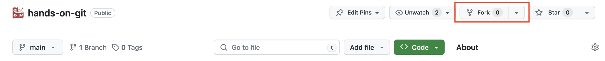
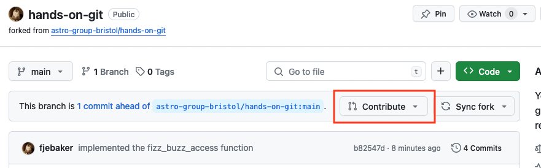
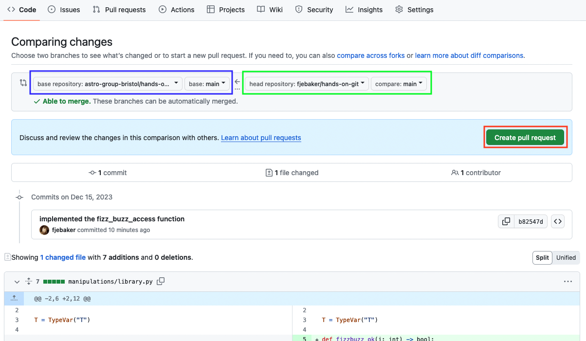
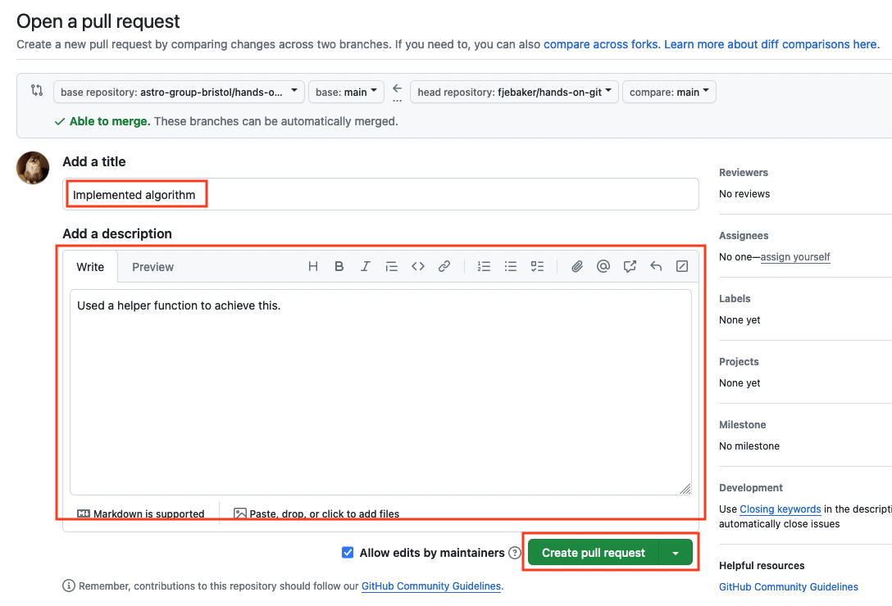
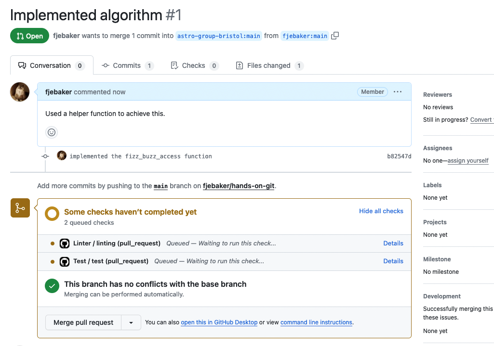

# Hands-on Git

A short and dirty run-through of some common git and GitHub commands and problems.

## Your task

We at Mega-Money R&D Incorporated have a revolutionary new indexing method that we need developed. We call it [Fizz Buzz](https://en.wikipedia.org/wiki/Fizz_buzz) indexing, and its going to be your task to implement it. Here's the setup

## Getting a copy of the source

You're going to want a fork of this repository where you can do your working. A fork is a GitHub feature that lets you create an independent copy of an entire git tree that you have full control over. It's normally the first thing you need to do in order to contribute to a project



Now that you have your fork, you need to get a copy of the code you can work on. You do that by "cloning" your fork onto your machine. This is a git feature, and so is best done on your command line:

```bash
git clone "https://github.com/YOUR_USERNAME/hands-on-git
```

You'll be able to see the full source tree in the newly created `hands-on-git` directory.

Within this directory, you can now install all of the Python dependencies needed to run the code. Since we are intending to modify the source code, we will also want the development dependencies with `-d`:

```bash
pipenv install -d
```

## Making a change

The setup of this repository uses [pytest](https://docs.pytest.org/en/7.4.x/) to validate behaviours. We don't need to know how pytest works to use it, which is already conveniently wrapped for us in the Pipenv file as a script:

```bash
pipenv run test
```

<a href="https://asciinema.org/a/1GnfFxG2bfzjxAuJH8D5Du11v" target="_blank"></a>

At the moment, as you can see, the code is broken. We can see it is testing the `manipulations.fizz_buzz_access` method. Open `manipulations.library` in your editor of choice, and implement the function. Run `pipenv run test` periodically until that test case passes. **Be sure to update the documentation if you change the behaviour of the function or notice any edge cases**. Get creative with it!

Once you're happy with it, we need to commit the change to git

## Preparing your first commit

If this is your first time committing, you need to tell git who you are so that your commit is given the correct author. You can do this once for your whole machine with

```bash
git config --global user.name="YOUR_USERNAME"
git config --global user.email="YOUR_EMAIL"
```

It makes sense to **use your GitHub username and email here**.

## Adding your changes

Git is under the hood tracking how files change by recording "diffs", which mark, for example, how characters within a line changes. As a consequence, git can store changes extremely efficiently.

To add your changed, first of all inspect what you have changed with

```bash
git status
```

Status is a subcommand you will run a lot: it provides a quick overview of what you are about to commit and what the status of your changes are.


We only changed one file, so we want to make sure that is the only file we "add". Adding in git is to stage something for your commit. For example, we want to add our implemented, so we do

```bash
git add ./manipulations/library.py
```

If we do `git status` now, we can see that the `library.py` file is staged to be committed. If we want to double check exactly what we have changed, we can run

```bash
git diff --staged
```

If you added something you didn't mean to when you check with `git status`, you can use `git restore --staged <path>` to unstaged it. **Do not use `git rm` to remove staged files from a commit**.

<a href="https://asciinema.org/a/omDV8iEPpG9MmDOZlHKqahrci" target="_blank"></a>

Now that everything is set, our changes are clean, and we have only the files we want to commit added, we can commit the changes with a sensible message. This commit message is for you to be able to quickly work out where changes were made in a project; the more descriptive they are, the more useful having those commits will be.

```bash
git commit -m "implemented the fizz_buzz_access function"
```

If we run `git status` now, we will see the files we have staged are no longer listed. You can check your commit history with

```bash
git log
```

<a href="https://asciinema.org/a/FysSBjuhbsD3OfKwjPoojkQh0" target="_blank"></a>

These changes are now only present on our computer. We need to sync them back to the fork, which we can do with

```bash
git push origin main
```

Navigate in a web browser to your fork and you should see your commit there.


## Opening a pull request

Next, we want to take the changes we made in our fork and open a Pull Request. This is a GitHub feature, and so we do it in the web browser. It allows us to request that another user pulls our changes into their repository.

Pull requests are sometimes called "merge requests" to reflect the fact that under the hood it is using the `git merge` subcommand.

Pull requests are a great place to have discussions about code and changes, and often some level of quality assurance and test automation will be run to ensure changes are good. Don't worry about opening unfinished pull requests, the review process is supposed to be iterative, and it's better to share work in progress code than never any code at all.




Before you write about your pull request, you get a quick preview of what you want to try and merge where (green box into blue box). Make sure you select your fork's main branch as the source and the upstream main as the remote.Then press "Create pull request"



Then write a quick description of what you did, summarising the commit messages. Also outline any further actions or thoughts you have in the description to promote discussing your work.




Now we wait for the checks to run! If any of them fail, we can iterate by going back to our clone on our computer, committing new changes, and pushing to our fork. The PR will automatically get the next commits and include them in the PR.



## Things to play about with

1. What happens if you noticed you missed something in your commit? How can you undo a commit without losing your changes?

2. What happens if you rename your fork after you have cloned the repository? How can point the remote in your clone to the new url?

3. How can you open multiple PRs simultaneously? What else can you use branches for?
